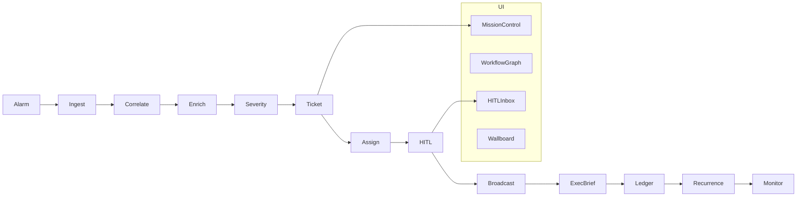

# Kenya NOC Mission Control (`soc-agents`)

Multi-agent **incident escalation & management** system for Kenyan telecom NOC operations.

| Profile | Role |
|---------|------|
| **Safaricom PLC (default)** | Primary — 6 regions, ~7k sites, `INC######` (9-char) tickets, floor MSP matrix |
| **Airtel Kenya** | Secondary YAML profile (`OPERATOR_PROFILE=airtel`) |

> Demo / training product. **Not** an official Safaricom or Airtel system.

## What it does

Agents replace most NOC toil; humans stay **HITL**:

1. Ingest & correlate alarms  
2. Severity P1–P4 (Safaricom: P4 &lt; 50k users; HUB floor P2; CORE → P1)  
3. Auto-ticket major HUB/CORE failures with unique incident numbers  
4. Assign FE or MSP (ATC, Camusat, Egypro)  
5. Broadcast RNIO / FE / MSP (held for HITL on P1/P2 under L2)  
6. Exec brief (cut “what’s the cause?” phone spam)  
7. Shift Excel ledger + day/night handover  
8. Recurrence → problem records  
9. **Team Mission Control UI** with **live multi-agent workflow graph**

## Safaricom regions (ops model)

| Code | Label | Example coverage |
|------|--------|------------------|
**~7,000 sites · 50M+ subscribers · 6 regions · tickets `INC######` (9 chars)**

| Code | Region | Power MSP | TX / Fibre | Radio OEM |
|------|--------|-----------|------------|-----------|
| **NBI_E** | Nairobi East | Egypro / Remote Egypro | Egypro Fibre | Mixed |
| **NBI_W** | Nairobi West | ATC / Camusat | Camusat, Ecta, Adrian, Alan Dick | **Huawei** |
| **MTK** | Mt Kenya | Egypro / Remote Egypro | **Soliton**, Egypro Fibre | Mixed |
| **CST** | Coast | ATC / Camusat | Camusat, Ecta, Adrian… | **Huawei** |
| **RFT** | Rift Valley | **Tetranet** | Camusat / Ecta / Egypro Fibre | Mixed |
| **WNY** | Western-Nyanza | **Tetranet** | Camusat / Ecta / Egypro Fibre | **Nokia+Huawei** |

**Priority:** P4 &lt;50k · P3 &lt;100k · P2 100k–&lt;500k · P1 ≥500k subscribers  

Timezone: **Africa/Nairobi (EAT)**.

## Architecture



## Quick start (live Mission Control)

```bash
# from soc-agents/ — Linux / macOS
python3 -m venv .venv && .venv/bin/python -m pip install -e ".[dev]"
(cd frontend && npm install)
bash scripts/run_all.sh            # or: make demo-up
# open http://127.0.0.1:8000  — press "Launch heavy-rain storm (live)" on Mission control
```

```powershell
# Windows
python -m pip install -e ".[dev]"
cd frontend; npm install; cd ..
powershell -ExecutionPolicy Bypass -File .\scripts\run_all.ps1
```

**Showing it to managers:** press **Guided demo** in the top bar (five steps: storm, ticket,
approval, handover, numbers) and finish on **/showcase**, the page that reads the live
productivity numbers. Script and talking points: `docs/MANAGER_DEMO.md`. Where the project
stands: `docs/STATUS.md`.

Or two terminals (best live WebSocket during dev):

```powershell
# Terminal 1
python -m uvicorn noc_agents.main:app --app-dir src --host 127.0.0.1 --port 8000

# Terminal 2
cd frontend; npm run dev
# open http://127.0.0.1:5173  — the top bar must read "Live"
```

**Empty board:** Mission Control auto-launches the rain/MW cascade once per browser session.  
**Storm content:** Rift + Mt Kenya + Nairobi East microwave hops fail; child sites cascade under HUB majors.

## Tests

| Layer | Path |
|-------|------|
| Unit | `tests/unit/` — priority, assignment, fingerprint, shifts |
| Integration | `tests/integration/` — full pipeline, idempotency, recurrence, handover |
| System | `tests/system/` — FastAPI health, ingest, workflow, HITL, metrics |

```bash
python -m pytest -q                 # 3,208 tests, about seven minutes, no network
cd frontend && npm run build        # TypeScript + Vite bundle
python scripts/screenshots.py out/  # every route at 375 and 1440 px against a running stack
```

`GET /api/v1/metrics/productivity` is the rollup behind `/showcase`: what the agents did, and
what the operator profile's `productivity.toil_minutes` says it would have cost by hand.

## UI map

The console follows the shift: Day theme 06:00-18:59 EAT, Night otherwise (pin either from **Display**). Sidebar groups open and close like dropdowns; **Collapse sidebar** folds it to a rail whose icons open a menu of their pages. Design rules: `docs/DESIGN_SYSTEM.md`.

| Route | Purpose |
|-------|---------|
| `/` | Front door: the twelve agents drawn as a fibre ribbon carrying the latest real run, the four desks live, the support evals, the autonomy ladder |
| `/mission` | Mission Control: KPIs, the **agent rail** following the newest alarm live, incidents, ticker, HITL |
| `/support` | Support desk: complaint queue with the full agent trace, cases waiting for a person, knowledge base, evals |
| `/complain` | Public online complaint form; shows the customer what each agent did |
| `/showcase` | For managers: live numbers, the twelve steps before/after, platform diagram, autonomy ladder, toil model |
| `/incidents/:id` | Workspace: agent-filled ticket fields + the rail of the run that opened the ticket |
| `/hitl` | Shared claim/approve/reject queue |
| `/shift` | Ledger + handover |
| `/wallboard` | TV-friendly P1/P2 |
| `/agents` | Agent observatory: roster with real throughput per agent, recent runs |
| `/workflow` | Workflow map: the twelve hops, what each does, minutes by hand |
| `/settings` | Role + **demo inject** (Westlands HUB, Coast, Nyanza, NEA, …) |

## Support desk

A multi-agent desk for **customer complaints**, beside the NOC it serves (contract:
[`docs/SUPPORT_DESK.md`](docs/SUPPORT_DESK.md)). A customer registers a complaint online; a
**triage agent** classifies it (category, urgency, sentiment, fraud / legal / safety flags,
English, Kiswahili or Sheng); a **resolver** answers from a 20-article knowledge base only when
the answer is grounded, citing the article; an **action agent** fixes the account through tools
under policy limits (M-PESA wrong-number reversal, refunds, bundle re-credits, device settings)
and links "no network in Nakuru" to the **live NOC incident** for Nakuru; hard cases go to a
person with a reason. Every step is traced. Deterministic by default; tools act on demo fixtures
and nothing is ever sent.

- Code `src/noc_agents/support/`, routes `src/noc_agents/api/routers/support.py`, tables
  `db/models_support.py`; policy, knowledge base and demo accounts in `config/support/`.
- `SUPPORT_DESK_ENABLED` (default `true`; `false` makes every route 404).
- Routes under `/api/v1/support`: `POST /complaints` (the public form, rate-limited per number and per address),
  `GET /complaints`, `GET /complaints/{id}`, `POST /complaints/{id}/claim|resolve`,
  `POST /complaints/{id}/actions/{tool_call_id}/approve|reject`, `GET /kb`, `GET /kb/search?q=`,
  `GET /metrics`, `GET /evals/latest`, `POST /evals/run`, `POST /demo/seed`.
- Try it: `POST /api/v1/demo/rain-storm`, then `POST /api/v1/support/demo/seed` (a dozen
  complaints across every route and status, the outage ones linked to the storm's tickets).

**Evals.** The golden set `tests/fixtures/support_eval/golden.jsonl` (English, Kiswahili, Sheng;
every route and escalation reason) runs through the real pipeline on throwaway in-memory
databases and is gated on resolution rate >= 0.80, wrong-escalation rate <= 0.10, zero missed
safety escalations and triage accuracy >= 0.85:

```bash
python tests/eval/support_eval.py             # deterministic; --split dev|test, --json out.json
python tests/eval/support_eval.py --llm       # nightly comparison with LLM tie-breaks (needs LLM_ENABLED)
python -m pytest -q tests/unit/test_support_*.py tests/system/test_support_api.py
```

`POST /api/v1/support/evals/run` runs the same suite in-process and keeps the report for
`GET /api/v1/support/evals/latest`.

## Config

- `config/default.yaml` — active profile  
- `config/operators/safaricom.yaml` — primary (detailed regions)  
- `config/operators/airtel.yaml` — secondary  

```bash
set OPERATOR_PROFILE=airtel   # Windows PowerShell: $env:OPERATOR_PROFILE="airtel"
```

## Docs

- `SUPER_PROMPT_NOC_MULTI_AGENT.md` — generation prompt  
- `RESEARCH_NOC_MULTI_AGENT.md` — industry research  
- **`docs/STATUS.md`** — where the project is, in plain language  
- **`docs/MANAGER_DEMO.md`** — the ten-minute manager demo script and the questions you will get  
- `docs/UI_WALKTHROUGH.md` — 5-minute team demo script  
- **`docs/GAP_ANALYSIS_AND_ROADMAP.md`** — flaws found + hardening log + Phase B/C roadmap  
- **`docs/SUPPORT_DESK.md`** — the customer support desk: flow, API, escalation policy, evals  

## Gmail demo email

Outage broadcasts can **really email your Gmail** for demos:

1. Create a Google **App Password** (not your normal password)  
2. Set env vars (see `docs/GMAIL_SETUP.md` and `.env.example`):

```powershell
$env:GMAIL_ADDRESS = "you@gmail.com"
$env:GMAIL_APP_PASSWORD = "xxxx xxxx xxxx xxxx"
$env:DEMO_EMAIL_TO = "you@gmail.com"
$env:EMAIL_ENABLED = "true"   # required since Phase 0 — sending is opt-in
```

3. Restart API → Settings → **Send test email**  
4. Inject P4 for instant mail, or P2 HUB → HITL Approve to send  

Without credentials — **or without `EMAIL_ENABLED=true`** — the system stays on **mock** (tests stay green).

## Hardening highlights (post-MVP)

- Full **NOC TT fields**: category, symptom, site class, technology, battery countdown, vendor TT, resolution  
- **Region × domain MSP** (e.g. Nairobi power→ATC, Coast power→Camusat)  
- **HUB cascade**: child sites with `parent_hub_id` attach to open HUB major  
- **WorklogMonitor** silence/SLA chase: `POST /api/v1/monitor/tick`  
- **Close / reassign / MSP notes** drive real status transitions  
- HITL claim/approve **WebSocket** events for dual-browser shifts  
- Excel ledger timestamps in **EAT**
